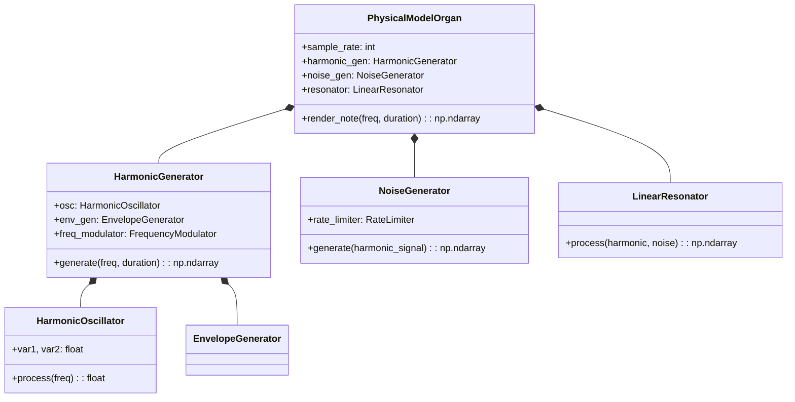

# Architektura systemu syntezy – OpenPhysis (pre-alpha)

Wersja: pre-alpha  
Status: wczesny prototyp, zgodny z logiką patentu Viscount Physis (US7442869B2), przepisany na obiektowy model w języku Python.

## Przegląd warstwowy

| Warstwa             | Komponenty główne                         |
|---------------------|-------------------------------------------|
| **Sygnał źródłowy** | `HarmonicGenerator`, `NoiseGenerator`     |
| **Modelowanie**     | `LinearResonator`                         |
| **Instrument**      | `PhysicalModelOrgan`                      |
| **Output**          | Buforowane wyjście (implementacja otwarta) |

## Diagram klas (UML)



## Mapowanie klas → struktura patentu (US7442869B2)


| Klasa                | Odpowiada blokowi z patentu    |
| -------------------- | ------------------------------ |
| `HarmonicOscillator` | Oscylator VAR1, VAR2 (14)      |
| `EnvelopeGenerator`  | ENV1/ENV2 (20a/20b)            |
| `HarmonicGenerator`  | Sumator + ścieżki A/B (21)     |
| `NoiseGenerator`     | RATE + NOISE BOX (10–12)       |
| `RateLimiter`        | Limitator szybkości (42)       |
| `LinearResonator`    | Rezonator liniowy (Fig. 15)    |
| `PhysicalModelOrgan` | Cała struktura główna (Fig. 2) |

## Appendix: Algorytm syntezy

Poniżej przedstawiono uproszczony zapis algorytmu syntezy piszczałkowej zgodny ze strukturą patentu Viscount US7442869B2, odwzorowany we wzorach matematycznych.

### 🎹 1. Generator harmoniczny

#### 1.1 Oscylator sinusoidalny (blok 14)

```plaintext
VAR1[n] = clip(VAR1[n-1] - F² · VAR2[n-1], [-1, 1])
VAR2[n] = VAR2[n-1] · (1 + ε) + VAR1[n]
F = 2 · sin(π · f / fs)
```

gdzie:

- f – częstotliwość generowanego tonu
- fs – częstotliwość próbkowania
- ε ≈ 1e-5 – stała stabilizująca
- clip(x, a, b) – ograniczenie wartości x do przedziału [a, b]

#### 1.2 Konwersja nieliniowa (blok 15)

```plaintext
y[n] = 2 · VAR1[n]² - 1 = -cos(2ω₀n)
ω₀  = 2π · f / fs
```

#### 1.3 Ścieżki przetwarzania A i B

```plaintext
x1[n] = GAIN1 · clip(y[n], ±CLIP1) · ENV1[n]
x2[n] = GAIN2 · clip(y[n], ±CLIP2) · ENV2[n]
z[n]  = x1[n] + x2[n]
```

### 2. Przetwarzanie harmoniczne

#### 2.1 Linia opóźniająca + tłumik

```plaintext
z1[n] = CBYP · z[n] + CDEL · z[n - N]
```

#### 2.2 Nieliniowe przekształcenie (blok 26)

```plaintext
z2[n] = z1[n] - z1[n]^4
```

#### 2.3 Filtr pasmowoprzepustowy (blok 27)

```plaintext
H(z) = 1 / (1 - r·cos(ω₀)·z⁻¹ + r²·z⁻²)
```

#### 2.4 Sumator wyjściowy

```plaintext
OUT_harm[n] = GAIND · z[n] + GAINF · BPF(z2[n])
```

### 3. Generator szumu (Fig. 10–12)

#### 3.1 Generacja sygnału RATE

```plaintext
RATE[n] = RTGAIN · clip(HPF(VAR1[n])) · ENV_rate[n]
```

#### 3.2 NOISE BOX

```plaintext
y[n] = Σ (NCGAIN · x[n - k] + NBFBK · y[n - M])
```

#### 3.3 Limitator szybkości

```plaintext
y_lim[n] = y[n - 1] + clip(x[n] - y[n - 1], ±RATE[n])
```

#### 3.4 Obwiednia szumu

```plaintext
NOISE[n] = NGAIN · y_lim[n] · ENV_noise[n]
```

### 4. Rezonator liniowy (Fig. 15)

#### 4.1 Sygnał wejściowy rezonatora

```plaintext
x[n] = OUT_harm[n] + NOISE[n]
```

#### 4.2 Bloki filtrujące

```plaintext
x1[n] = LPF(x[n])
x2[n] = HPF(x1[n])
x3[n] = APF(x2[n])
```

#### 4.3 Sprzężenie zwrotne

```plaintext
feedback[n] = TFBK · delay(x3[n]) · FBKENV[n]
D(z) = z⁻ᴺ
```

### 5. Wyjście

```plaintext
y[n] = TFBK · delay_line[k]
```

Legenda:

- f – częstotliwość tonu
- fs – częstotliwość próbkowania
- N – długość linii opóźnienia
- clip(x, a, b) – ograniczenie x do zakresu [a, b]
- ENV – obwiednia (amplitudy, szumu, sprzężenia)
- GAIN – współczynniki wzmocnienia
- LPF, HPF, APF – odpowiednio filtry: dolno-, górno- i wszechprzepustowy
- TFBK – współczynnik sprzężenia zwrotnego
- BPF() – filtr pasmowoprzepustowy
- Σ – suma (zwykle po opóźnieniu k)